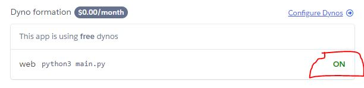

# Crypto Price Finder

A Telegram bot to look up price and related information on CoinMarketCap.


## Description

This is a Telegram bot application written in Python and using only FREE resources. It can be run either locally by running a script, or by uploading it to Heroku cloud platform. The project uses API of multiple platforms and includes creating accounts and generating API keys on those platforms. Setting up each and every platform will not be explained fully, just links and comments.

## Setting up

### Dependencies

* [Python 3](https://www.python.org/downloads/)
* [Create a Heroku account (Free Tier)](https://heroku.com/)
* [Create a Pro CoinMarketCap API account (Free Tier)](https://pro.coinmarketcap.com/)
* [Create a Amazon AWS S3 account (Free Tier)](https://aws.amazon.com/)
* [Download Telegram and create a personal account](https://desktop.telegram.org/)

### Installing

1. Download the code
2. If to be run locally, install Python modules. Navigate to the project directory and run:

    ```bash
    pip install requirements.txt
    ```

3. Create a bot in Telegram using [@BotFather](https://t.me/botfather). Get API token from it and paste it into **config.ini**:

    ```ini
    TELEGRAM_TOKEN = Your-telegram-bot-token
    ```

4. (Optional) Connect the bot to a Stripe payment system using [@BotFather](https://t.me/botfather). Get API Token from it and paste it into **config.ini**. *Note*: Stripe supports Test mode. Just follow instructions in [@BotFather](https://t.me/botfather) to set it up.

    ```ini
    STRIPE_TOKEN = Your-stripe-token
    ```

5. Login to your Heroku account in browser and ["Create New APP"](https://dashboard.heroku.com/new-app). Give it a name. Copy this name to a variable in a **config.ini**:

    ```ini
    HEROKU_URL_NAME = Your-heroku-application-name
    ```

6. Login to Pro CoinMarketCap Account and find an API key. Copy it to a variable in a **config.ini** file:

    ```ini
    COINMARKETCAP_API_KEY = Your-coinmarketcap-api-key
    ```

    **IMPORTANT**: Code is written to use two CoinMarketCap API keys, the second one as a backup if all credits are used in a free tier account. If you use the second account as well, add it right below as follows:

    ```ini
    COINMARKETCAP_API_KEY_2 = Your-coinmarketcap-api-key_2
    ```

    If the second account is not used: set this value to None:

    ```ini
    COINMARKETCAP_API_KEY_2 = None
    ```

7. Follow [this](https://towardsdatascience.com/how-to-upload-and-download-files-from-aws-s3-using-python-2022-4c9b787b15f2) tutorial to setup Amazon AWS S3 account and find the necessary API variables. Put them into aws_s3.py:

    ```ini
    AWS_BUCKET_NAME = Your-aws-bucket-name
    AWS_ACCESS_KEY_ID = Your-aws-access-key-id
    AWS_SERVER_SECRET_KEY = Your-aws-server-secret-key
    REGION = Your-chosen-region
    ```

That should be it... Pheeeew, easy right?

### Executing program

Execution depends on whether the application will be run locally from a computer or using Heroku cloud platform.

**To run locally:**

1. Navigate to *main.py* and set:

    ```python
    RUN_THROUGH_HEROKU = False
    ```

2. Navigate to *coinmarketcap.py* and set:

    ```python
    DEBUG_DONT_USE_AWS = True
    ```

    *(One tends to run local version quite frequently for test purposes, so saving some Amazon PULL credits is useful. If intended to be run long-time as local -> go ahead and set DEBUG_DONT_USE_AWS to False).*

3. Run the application with:

    ```bash
    python3 main.py
    ```

**To run via Heroku:**

1. Navigate to *main.py* and set:

    ```python
    RUN_THROUGH_HEROKU = True
    ```

2. Navigate to *coinmarketcap.py* and make sure that:

    ```python
    DEBUG_DONT_USE_AWS = False
    ```

3. Open a Terminal and navigate to the project directory. *Example:*
    

4. Commit your local application to Heroku:

    ```bash
    git add .
    git commit -m "Commit Message"
    git push heroku master
    ```

    The application will be pushed to Heroku, built, and enabled if no errors occured. Open your Heroku application browser page to find the app's status. *Example*:
    

## Tips & Help

The code is heavily commented and overly-explained. If there are still questions, find my contact below in **Authors** section.

### Heroku logs

Check Heroku application logs in real time. *Note*: command must be run from a project directory.

```bash
heroku logs -t
```

### Disable/enable Heroku application

There is no "formal" way to disable a running Heroku application except deleting it. A work-around is to disable/enable it's online access which will stop the application from working. *Note*: if Heroku app is stopped using this way, one can even run the application locally from a computer and it will work! Use it to test your application locally before comitting to Heroku.

To disable:

```bash
heroku ps:scale web=0
```

To enable:

```bash
heroku ps:scale web=1
```

## Authors

### Eugene Galaxy

[](https://discordapp.com/users/235795203930193923)
[](https://t.me/eugenegalaxy)
[](https://github.com/eugenegalaxy)

[](https://www.buymeacoffee.com/eugenegalaxy)

## License

This project is licensed under the GNU GPLv3 License - see the LICENSE.md file for details

## Acknowledgments

* [How I made my first advanced telegram bot using python](https://amir-tech.medium.com/how-i-made-my-first-advanced-telegram-bot-using-python-72f1210c0900)
* [How to Deploy a Telegram Bot using Heroku for FREE](https://towardsdatascience.com/how-to-deploy-a-telegram-bot-using-heroku-for-free-9436f89575d2)
* [How to Upload And Download Files From AWS S3 Using Python (2022)](https://towardsdatascience.com/how-to-upload-and-download-files-from-aws-s3-using-python-2022-4c9b787b15f2)
* Countless people from StackOverflow and GitHub repo issues.
